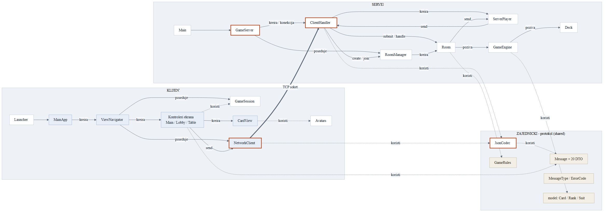
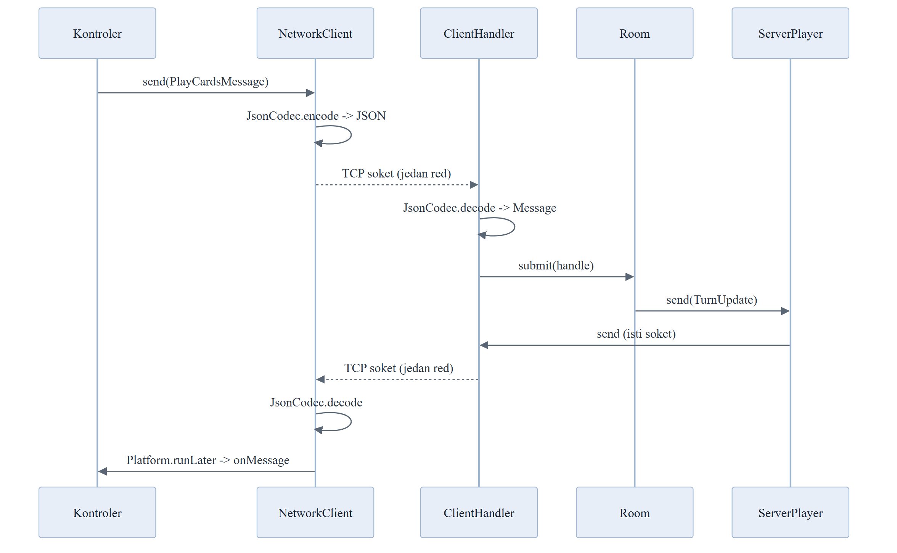

# Arhitektura i objašnjenje koda

Interni dokument tima **Muvrinovci** — namenjen članovima tima koji treba da razumeju, menjaju i brane kod na odbrani.

Težište je na **mrežnom delu**, jer je on suština predmeta i ujedno najkomplikovaniji deo projekta.

---

## Sadržaj

1. [Pregled u tri rečenice](#1-pregled-u-tri-rečenice)
2. [Struktura projekta](#2-struktura-projekta)
3. [Mrežni sloj](#3-mrežni-sloj)
4. [Protokol — sve poruke](#4-protokol--sve-poruke)
5. [Model niti i zašto nema `synchronized`](#5-model-niti-i-zašto-nema-synchronized)
6. [Tajmeri i problem zakasnelih zadataka](#6-tajmeri-i-problem-zakasnelih-zadataka)
7. [Game engine — pravila igre](#7-game-engine--pravila-igre)
8. [Klijent](#8-klijent)
9. [Šta se dešava kad neko prekine vezu](#9-šta-se-dešava-kad-neko-prekine-vezu)
10. [Testovi](#10-testovi)
11. [Pitanja koja mentor može postaviti](#11-pitanja-koja-mentor-može-postaviti)
12. [Gde šta tražiti](#12-gde-šta-tražiti)

---

## 1. Pregled u tri rečenice

Igra je **klijent-server** aplikacija sa **autoritativnim serverom**: server je jedini koji zna pravo stanje partije, a klijenti su „tanki" — samo prikazuju ono što im server pošalje i šalju nazad korisnikove akcije.

Komunikacija ide preko **sirovog TCP soketa**, a poruke su **JSON objekti, jedan po redu** (newline-delimited).

Server nikada ne veruje klijentu: svaku akciju proverava sam — da li si na potezu, da li stvarno imaš te karte, da li je vrednost dozvoljena.

> **Zašto autoritativni server?** Da varanje ne bi bilo moguće. Da klijent drži svoje karte i sam prijavljuje šta baca, izmenjen klijent bi mogao da baci karte koje nema. Ovako klijent uopšte ne zna tuđe karte — server mu šalje samo *broj* tuđih karata.

---

## 2. Struktura projekta

Maven multi-modul projekat sa tri modula:

```
rmtlazov/
├── shared/    Model karata i mrezni protokol  (Gson, BEZ JavaFX-a)
├── server/    Autoritativni server            (Gson + shared, BEZ JavaFX-a)
└── client/    JavaFX klijent                  (JavaFX + shared)
```

**Zašto tri modula, a ne jedan?**

| Modul | Razlog postojanja |
|---|---|
| `shared` | Protokol mora biti **identičan** na obe strane. Da su klase duplirane, promena na jednoj strani bi tiho pokvarila drugu. Ovako se neslaganje vidi već pri kompajliranju. |
| `server` | Ne zavisi od JavaFX-a, pa se može pokrenuti **headless** — na virtuelnoj mašini preko SSH-a, bez grafičkog okruženja. |
| `client` | Jedini modul koji vuče JavaFX. |

> Zbog međuzavisnosti se gradi sa `mvn clean install`, **ne** `package` — `install` smešta `shared` u lokalni Maven repozitorijum, pa `server` i `client` mogu da se pokreću zasebno.

---

## 3. Mrežni sloj

### 3.0 Mapa saradnje klasa

Klase sa crvenom ivicom čine mrežni sloj (rade sa soketom); plave koriste JavaFX; bež su zajednički protokol.



Ista poruka putuje kroz `JsonCodec` četiri puta — encode i decode na svakoj strani:



### 3.1 Zašto TCP a ne UDP

TCP garantuje da poruke stižu **i to redosledom kojim su poslate**. Za ovu igru je to obavezno — ako bi „bacio si 3 sedmice" stiglo pre „nova runda počinje", klijent bi prikazao besmislicu. Igra je na poteze, pa nam kašnjenje od par desetina milisekundi ništa ne znači; pouzdanost nam znači sve.

### 3.2 Okvir poruke (framing)

TCP je **stream bajtova, ne poruka**. To je ključna stvar koju treba razumeti: TCP ne zna gde jedna poruka prestaje a druga počinje. Ako pošalješ dve poruke, mogu stići kao jedan blok, ili kao tri komada — TCP samo garantuje da će bajtovi stići **redom**.

Zato je potreban dogovor gde je granica poruke. Naš dogovor je najjednostavniji mogući: **jedna poruka = jedan red teksta**, granica je znak za novi red.

Zbog toga na obe strane stoji isti obrazac:

```java
// slanje - println sam dodaje \n
writer.println(JsonCodec.encode(message));

// citanje - readLine cita tacno do \n
while ((line = reader.readLine()) != null) { ... }
```

`PrintWriter` je napravljen sa `autoFlush = true` (drugi argument konstruktora), pa se svaki `println` odmah šalje. Bez toga bi poruke ostajale u baferu i igra bi „štucala".

> **Zašto je `\n` bezbedan razdelnik:** JSON koji šaljemo nikad ne sadrži pravi znak za novi red unutar sebe — Gson ga u stringovima ispisuje kao dva karaktera (`\` i `n`).

Obe strane koriste **UTF-8** eksplicitno (`StandardCharsets.UTF_8`), a ne podrazumevani encoding sistema. To je bitno jer su nam poruke o greškama na srpskom — bez toga bi se na različitim mašinama slova raspala.

### 3.3 Kodiranje poruka: `JsonCodec`

Fajl: [`shared/protocol/JsonCodec.java`](../shared/src/main/java/com/muvrinovci/lazes/shared/protocol/JsonCodec.java)

Problem koji rešava: Gson pri čitanju JSON-a **ne zna u koju klasu treba da ga pretvori**. Stigao je tekst — je li to `play_cards` ili `call_liar`?

Rešenje: svaka poruka nosi obavezno polje `type`, a `JsonCodec` drži **registar** koji tip preslikava u klasu:

```java
private static final Map<String, Class<? extends Message>> REGISTRY = Map.ofEntries(
        Map.entry(MessageType.PLAY_CARDS, PlayCardsMessage.class),
        Map.entry(MessageType.CALL_LIAR,  CallLiarMessage.class),
        ...);
```

Čitanje ide u dva koraka:

1. Parsiraj JSON kao običan objekat i pročitaj **samo** polje `type`
2. Nađi klasu u registru, pa tek onda pusti Gson da popuni tu klasu

Svaka greška — neispravan JSON, nedostaje `type`, nepoznat tip — završava kao `ProtocolException`, koju server hvata i vraća klijentu `error` poruku sa kodom `MALFORMED_MESSAGE`. **Neispravna poruka nikad ne obara server.**

### 3.4 Server: prihvatanje konekcija

Fajl: [`server/GameServer.java`](../server/src/main/java/com/muvrinovci/lazes/server/GameServer.java)

```java
while (!serverSocket.isClosed()) {
    Socket socket = serverSocket.accept();              // blokira dok neko ne dodje
    connections.submit(new ClientHandler(socket, roomManager));
}
```

`accept()` **blokira** dok se neko ne poveže. Zato svaka konekcija dobija svoju nit iz `newCachedThreadPool` — inače bi drugi igrač morao da čeka da prvi završi partiju.

Sve niti su **daemon niti**, pa se JVM ugasi čim se glavna nit završi; bez toga bi server visio u pozadini posle `Ctrl+C`.

`start(port)` se odmah vraća, a prihvatanje teče u pozadinskoj niti — zbog toga integracioni testovi mogu da podignu server, odigraju partiju i uredno ga ugase.

Port se bira ovim redosledom: **argument komandne linije → promenljiva okruženja `PORT` → podrazumevanih 5555**. Promenljiva okruženja postoji zbog platformi za hostovanje, koje port često zadaju same.

### 3.5 Server: jedna nit po konekciji

Fajl: [`server/ClientHandler.java`](../server/src/main/java/com/muvrinovci/lazes/server/ClientHandler.java)

Srce mrežnog sloja na serveru. Jedan objekat = jedna TCP konekcija = jedna nit.

```java
while ((line = reader.readLine()) != null) {
    if (line.isBlank()) continue;
    dispatch(line);
}
```

`readLine()` vraća `null` kada klijent **uredno** zatvori vezu. Ako veza **pukne** (nestanak struje, prekid mreže), leti `IOException`. **Oba slučaja** završavaju u `finally` bloku koji zove `disconnect("connection_lost")` — zato nijedan način prekida ne ostavlja „duha" za stolom.

Raspoređivanje poruka:

```java
switch (message.getType()) {
    case MessageType.CREATE_ROOM -> onCreateRoom(...);   // igrac jos nije u sobi
    case MessageType.JOIN_ROOM   -> onJoinRoom(...);     // igrac jos nije u sobi
    default -> forwardToRoom(message);                    // sve ostalo ide sobi
}
```

`create_room` i `join_room` obrađuje sam handler jer igrač u tom trenutku **još nije ni u jednoj sobi**, pa nema kome da se prosledi. Sve ostalo ide sobi.

Metoda `send` je **`synchronized`** jer više niti može pisati istom klijentu — nit njegove sobe, a u nekim trenucima i nit koja obrađuje njegovu poruku. Bez toga bi se dve poruke mogle ispreplesti u pola reda i pokvariti framing.

Ime igrača se ovde i **sanitizuje**: prazno ime se odbija (`INVALID_NAME`), a predugačko se skraćuje na 16 znakova.

### 3.6 Server: `RoomManager`

Fajl: [`server/RoomManager.java`](../server/src/main/java/com/muvrinovci/lazes/server/RoomManager.java)

```java
private final Map<String, Room> rooms = new ConcurrentHashMap<>();
```

`ConcurrentHashMap` je ovde **obavezan**, jer registru pristupaju niti raznih konekcija istovremeno — jedan igrač pravi sobu dok se drugi pridružuje.

**Kod sobe** je 6 znakova iz azbuke `ABCDEFGHJKLMNPQRSTUVWXYZ23456789`. Namerno **nema `I`, `O`, `0`, `1`** — da se kod ne bi pogrešno pročitao kad ga neko diktira preko telefona. Generisanje se ponavlja dok kod ne bude jedinstven, a koristi `SecureRandom` da kodovi ne budu pogodljivi.

Bitan detalj: `joinRoom` **ne proverava** je li soba puna ili je igra počela. Te provere radi sama soba, u svojoj niti — jer bi provera ovde bila `race condition`: između provere i stvarnog ulaska soba bi se mogla napuniti.

---

## 4. Protokol — sve poruke

Svaka poruka je JSON objekat sa obaveznim poljem `type`. Definicije su u [`shared/protocol/dto/`](../shared/src/main/java/com/muvrinovci/lazes/shared/protocol/dto).

### Klijent → Server

| `type` | Polja | Značenje |
|---|---|---|
| `create_room` | `playerName` | Napravi novu sobu; pošiljalac postaje host |
| `join_room` | `playerName`, `roomCode` | Uđi u postojeću sobu |
| `player_ready` | `ready` | Menja status spremnosti u lobby-ju |
| `set_avatar` | `avatar` | Bira boju mesta (`blue`/`red`/`green`/`gold`) |
| `start_game` | — | Samo host; pokreće partiju |
| `play_cards` | `cardIds`, `declaredValue` | Baca karte i deklariše vrednost |
| `call_liar` | — | Proziva onoga ko je upravo bacio |
| `draw_card` | — | Vuče kartu umesto bacanja |
| `leave_room` | — | Napušta sobu |

### Server → Klijent

| `type` | Ključna polja | Kada se šalje |
|---|---|---|
| `room_joined` | `roomCode`, `playerId`, `host` | Potvrda ulaska — **samo tom igraču** |
| `lobby_state` | `players[]`, `hostId`, `canStart` | Svaka promena u lobby-ju |
| `game_start` | `countdownSeconds`, `firstPlayerId` | Partija počinje; klijenti prikazuju 3-2-1 |
| `hand_update` | `cards[]` | **Samo tom igraču** — njegove karte |
| `turn_update` | `currentPlayerId`, `tableValue`, `centerCount`, `drawPileCount`, `players[]` | Posle svake promene stanja stola |
| `play_announced` | `playerId`, `declaredCount`, `declaredValue`, `callWindowMs` | Neko je bacio karte |
| `call_result` | `wasLying`, `revealedCards[]`, `cardsCollectedBy`, `collectedCount` | Neko je prozvao — karte se otkrivaju |
| `card_drawn` | `playerId`, `automatic` | Neko je vukao kartu |
| `player_disconnected` | `playerId`, `reason` | Igrač je otišao |
| `game_over` | `winnerId`, `ranking[]` | Kraj partije |
| `error` | `code`, `message` | Akcija odbijena |

### Ključna stvar: šta se kome šalje

Ovde se vidi da je server zaista autoritativan:

- `hand_update` ide **samo jednom igraču** (`player.send(...)`) — nikad se ne emituje svima
- `turn_update` ide svima, ali sadrži samo **brojeve** tuđih karata (`cardCount`), nikad njihov sadržaj
- `centerCount` je samo broj — karte na centru su okrenute nadole
- Sadržaj karata se otkriva **isključivo** u `call_result`, i to samo onih koje su upravo bačene

Drugim rečima: **klijent fizički ne poseduje podatak koji bi mu omogućio da vara.**

### Primer jedne razmene

Igrač baca dve karte i tvrdi da su sedmice:

```json
{"type":"play_cards","cardIds":["7H1","7S2"],"declaredValue":7}
```

Server prvo pošalje **samo njemu** njegovu novu ruku:

```json
{"type":"hand_update","cards":["3D1","10C2","KH1","AS2","5D2"]}
```

pa **svima** novo stanje stola, pa najavu:

```json
{"type":"turn_update","currentPlayerId":"a3f...","tableValue":7,"centerCount":2,"drawPileCount":76,"turnSeconds":30,"players":[...]}
{"type":"play_announced","playerId":"a3f...","playerName":"Milos","declaredCount":2,"declaredValue":7,"callWindowMs":5000}
```

> **Redosled nije slučajan.** U `onPlayCards` se prvo šalje `turn_update`, pa tek onda `play_announced` — da bi klijentu **poslednja primljena poruka uvek bila ona koja određuje fazu** u kojoj se nalazi. Da je obrnuto, `turn_update` bi stigao posle najave i klijent bi zatvorio prozor za prozivanje pre vremena.

Ako neko prozove:

```json
{"type":"call_liar"}
```

```json
{"type":"call_result","callerId":"b7c...","accusedId":"a3f...","declaredValue":7,
 "wasLying":true,"revealedCards":["7H1","9S2"],"cardsCollectedBy":"a3f...",
 "collectedCount":2,"nextPlayerId":"b7c..."}
```

### Kodovi grešaka

Poruka `error` nosi kod iz [`ErrorCode`](../shared/src/main/java/com/muvrinovci/lazes/shared/protocol/ErrorCode.java), pa klijent zna šta da prikaže: `ROOM_NOT_FOUND`, `ROOM_FULL`, `GAME_IN_PROGRESS`, `NOT_IN_ROOM`, `NOT_HOST`, `NOT_ENOUGH_PLAYERS`, `PLAYERS_NOT_READY`, `NOT_YOUR_TURN`, `INVALID_ACTION`, `INVALID_CARDS`, `INVALID_VALUE`, `DRAW_PILE_EMPTY`, `INVALID_NAME`, `MALFORMED_MESSAGE`.

---

## 5. Model niti i zašto nema `synchronized`

**Ovo je najvažniji deo za razumevanje projekta.**

### Problem

Tehnička specifikacija (Dokument 3, poglavlje 6) navodi rizik: šta ako **dva igrača istovremeno pošalju `call_liar`**? Obe poruke stižu u razmaku od par milisekundi, na dve različite niti. Bez zaštite bi obe prošle — obojica bi „prozvali", centar bi se podelio dvaput, stanje bi se raspalo.

### Uobičajeno rešenje i zašto ga nismo uzeli

Klasičan pristup je `synchronized` ili `ReentrantLock` oko svake metode koja dira stanje. Radi, ali:

- lako se zaboravi jedno mesto, pa se bag pojavljuje jednom u sto partija
- otvara mogućnost `deadlock`-a ako se zaključavaju dva objekta
- teško se testira, jer se greška ne reprodukuje pouzdano

### Naše rešenje: jedna nit po sobi

Svaka `Room` ima **sopstveni jednonitni executor**:

```java
private final ExecutorService executor = Executors.newSingleThreadExecutor(...);

public Future<?> submit(Runnable task) {
    return executor.submit(() -> { ... task.run() ... });
}
```

**Svaka** izmena stanja sobe prolazi kroz `submit`. Poruke sa mreže:

```java
// ClientHandler.forwardToRoom
room.submit(() -> room.handle(player, message));
```

I istekli tajmeri:

```java
scheduler.schedule(() -> submit(() -> onTurnTimeout(token)), TURN_SECONDS, SECONDS);
```

Pošto executor ima **tačno jednu nit**, zadaci se izvršavaju **strogo jedan za drugim**. Ako dva igrača pošalju `call_liar` u istoj milisekundi, oba zadatka uđu u red, ali se izvršavaju sekvencijalno: prvi prođe i prebaci fazu iz `CALL_WINDOW` u `TURN`, a drugi zatim padne na proveri `requirePhase(CALL_WINDOW)` i dobije `error`.

### Posledice

| Prednost | Objašnjenje |
|---|---|
| Nema `synchronized` u `Room` ni u `GameEngine` | Nema šta da se zaključava — pristup je već serijalizovan |
| Nema `deadlock`-a | Nema zaključavanja, pa nema ni ciklusa čekanja |
| `GameEngine` je običan jednonitni kod | Zato se testira običnim JUnit testovima, bez ikakve konkurentnosti |
| Sobe rade paralelno | Svaka soba ima svoju nit, pa spora soba ne blokira ostale |

> **Pravilo za tim:** ako dodaješ novu akciju, **nikad** ne diraj stanje sobe direktno iz `ClientHandler`-a ili iz tajmera. Uvek kroz `room.submit(...)`. To je jedino pravilo koje ceo ovaj model drži na okupu.

Jedina dva konkurentna mesta u celom serveru su, dakle: `ConcurrentHashMap` u `RoomManager`-u i `synchronized send` u `ClientHandler`-u.

---

## 6. Tajmeri i problem zakasnelih zadataka

Igra ima dva tajmera:

| Tajmer | Trajanje | Šta radi po isteku |
|---|---|---|
| Tajmer poteza | 30 s | Server vuče kartu umesto igrača; ako je špil prazan, baca prvu kartu iz njegove ruke |
| Prozor za prozivanje | 5 s | Runda se nastavlja, red ide dalje |

Svi tajmeri koriste **zajednički** `ScheduledExecutorService` iz `RoomManager`-a (2 niti za ceo server), ali se svaki istekli zadatak vraća u nit **svoje** sobe preko `submit`.

### Problem zakasnelog tajmera

Zamisli: tajmer poteza je zakazan na 30 s. U 29.99 s igrač odigra potez. Tajmer se otkazuje — ali `cancel()` **ne stiže uvek na vreme**: zadatak je možda već krenuo da se izvršava. Rezultat bi bio da server odigra potez umesto igrača koji je već odigrao.

### Rešenje: token

Soba drži brojač `actionToken`. Svaki put kad se stanje promeni, brojač se uvećava, a zakazani zadatak **pamti vrednost koju je brojač imao u trenutku zakazivanja**:

```java
private void startTurnTimer() {
    cancelTimer();
    long token = ++actionToken;                          // token za OVAJ tajmer
    pendingTimer = scheduler.schedule(
            () -> submit(() -> onTurnTimeout(token)), TURN_SECONDS, SECONDS);
}

private void onTurnTimeout(long token) {
    if (token != actionToken || state != RoomState.IN_GAME) {
        return;                                          // stanje se promenilo - odustani
    }
    ...
}
```

Ako se u međuvremenu bilo šta desilo, `actionToken` je već uvećan, pa se zakasneli zadatak **tiho odbacuje**. Provera se izvršava u niti sobe, dakle sekvencijalno — nema trke.

> Ovo je standardni obrazac, poznat kao *fencing token* ili *generation counter*. Isti trik štiti i odbrojavanje na početku partije (`beginFirstTurn`).

---

## 7. Game engine — pravila igre

Fajl: [`server/game/GameEngine.java`](../server/src/main/java/com/muvrinovci/lazes/server/game/GameEngine.java)

**Jedini autoritet nad stanjem partije**, i namerno **bez ijedne linije mrežnog koda**. Prima akciju, proveri je, vrati ishod kao `record`. Zbog toga se testira običnim JUnit testovima.

### Špil i identifikator karte

Igra ide sa **2 standardna špila = 104 karte**, rangovi 1–13 (As=1 … Kralj=13), bez džokera.

Pošto se igra sa dva špila, **ista karta postoji dvaput**. Zato identifikator nosi i redni broj špila:

```
7H1  = sedmica herc iz prvog spila
7H2  = sedmica herc iz drugog spila
10D2 = desetka karo iz drugog spila
```

Bez toga server ne bi mogao da proveri vlasništvo — igrač bi poslao `7H`, a server ne bi znao na koju od dve misli.

> Dokumentacija je na dva mesta pominjala opseg 1–14, što ne odgovara standardnom špilu od 13 rangova; usvojeno je 1–13.

### Faze

```
TURN  ──(playCards)──►  CALL_WINDOW  ──(callLiar ili istek)──►  TURN
  │                                                              │
  └──(drawCard)──────────────────────────────────────────────────┘
```

`GamePhase` ima tri vrednosti: `TURN`, `CALL_WINDOW`, `FINISHED`. Svaka akcija prvo proverava fazu (`requirePhase`), pa tek onda ostalo.

### Validacije u `playCards`

Svaka provera baca `GameException` sa svojim kodom:

1. faza mora biti `TURN`
2. pošiljalac mora biti na potezu → `NOT_YOUR_TURN`
3. bar jedna karta, najviše 8 → `INVALID_CARDS`
4. ista karta ne sme biti navedena dvaput → `INVALID_CARDS`
5. vrednost mora biti 1–13 → `INVALID_VALUE`
6. ako runda nije otvorena, vrednost mora biti jednaka `tableValue` → `INVALID_VALUE`
7. **igrač mora stvarno imati svaku od tih karata u ruci** → `INVALID_CARDS`

Tačka 7 je ta koja onemogućava varanje izmenjenim klijentom.

### Ko kupi karte pri prozivanju

```java
boolean wasLying = revealed.stream().anyMatch(card -> card.value() != declaredValue);
String collectorId = wasLying ? accusedId : callerId;
```

- **lagao** → optuženi kupi ceo centar, prozivač je sledeći na potezu
- **govorio istinu** → prozivač kupi ceo centar, optuženi igra ponovo

U oba slučaja prozivanje **zatvara rundu**: `tableValue` se vraća na `OPEN_ROUND`, pa sledeći igrač slobodno bira novu vrednost. Vučenje karte, za razliku od toga, **ne menja** vrednost runde.

### Uslov pobede — suptilnost

Igrač koji odigra poslednje karte **ne pobeđuje odmah**. Mora prvo da istekne prozor za prozivanje:

```java
// closeCallWindow - niko nije prozvao
if (hands.get(lastPlayerId).isEmpty()) {
    finish(lastPlayerId);        // TEK SADA je pobedio
}
```

Ako ga neko prozove i **lagao je**, kupi ceo centar i nastavlja da igra — dakle nije pobedio. Ako je **govorio istinu** i ostao bez karata, pobedio je uprkos prozivanju:

```java
String winner = !wasLying && hands.get(accusedId).isEmpty() ? accusedId : null;
```

---

## 8. Klijent

### `NetworkClient` — mrežni sloj klijenta

Fajl: [`client/NetworkClient.java`](../client/src/main/java/com/muvrinovci/lazes/client/NetworkClient.java)

Ogledalo `ClientHandler`-a. Ima **zasebnu nit za čitanje**, jer bi `readLine()` u JavaFX niti zamrznuo ceo prozor.

Ključni detalj — **`Platform.runLater`**:

```java
Message message = JsonCodec.decode(line);
Platform.runLater(() -> {
    Consumer<Message> current = listener;
    if (current != null) current.accept(message);
});
```

JavaFX ima strogo pravilo: **grafički interfejs se sme menjati isključivo iz JavaFX Application Thread-a**. Poruka stiže na mrežnoj niti, pa se preko `Platform.runLater` prebacuje u JavaFX nit. Bez toga bi aplikacija povremeno pucala uz `IllegalStateException: Not on FX application thread`.

Povezivanje ima **timeout od 5 sekundi**:

```java
socket.connect(new InetSocketAddress(host, port), CONNECT_TIMEOUT_MS);
```

Bez toga bi na pogrešnoj IP adresi klijent visio ceo minut dok operativni sistem ne odustane.

Polje `closing` razlikuje **naše** zatvaranje veze od **pucanja** veze — da se ne prikaže „Veza je prekinuta" kad korisnik sam izađe iz sobe.

### Ekrani

`ViewNavigator` menja scene i, što je bitnije, **prespaja slušaoca mreže na novi kontroler**:

```java
ScreenController controller = loader.getController();
controller.init(this);
network.setListener(controller::onMessage);
```

U svakom trenutku **tačno jedan** kontroler prima poruke. Svaki implementira `ScreenController` sa dve metode: `init(navigator)` i `onMessage(message)`.

| Ekran | FXML | Šta radi |
|---|---|---|
| Glavni meni | `MainMenu.fxml` | Ime, adresa servera, port; kreiranje i pridruživanje sobi |
| Lobby | `Lobby.fxml` | Kod sobe, lista igrača, Ready, izbor boje, Start (samo host) |
| Sto | `Table.fxml` | Ruka, protivnici, centar, tajmeri, dugmad, log |

`GameSession` drži podatke koje dele svi ekrani: ime, `playerId` koji je dodelio server, kod sobe i da li si host.

### Karte se crtaju u kodu

Fajl: [`client/view/CardView.java`](../client/src/main/java/com/muvrinovci/lazes/client/view/CardView.java)

Karta se crta JavaFX oblicima i Unicode simbolima (♠ ♥ ♦ ♣) — **projekat ne zavisi ni od jednog slikovnog fajla**, pa nema problema sa putanjama resursa ni licencama slika.

Ruka se prikazuje sortirana rastuće (`Card.BY_VALUE`), pa iste vrednosti stoje jedna uz drugu — igrač odmah vidi koliko ima karata neke vrednosti, što je bitno jer se baca 1–8 karata **iste** deklarisane vrednosti.

---

## 9. Šta se dešava kad neko prekine vezu

Pokriva korisnički zahtev US-12 i često je pitanje na odbrani.

Lanac događaja:

1. `readLine()` u `ClientHandler`-u vrati `null` (uredno) ili baci `IOException` (pucanje veze)
2. `finally` blok zove `disconnect("connection_lost")`
3. Zadatak se šalje u nit sobe: `room.submit(() -> room.leave(player, reason))`
4. `Room.leave` uklanja igrača i grana se:

```java
if (players.isEmpty()) {
    roomManager.removeRoom(code);    // prazna soba se brise
    shutdown();                      // gasi se i njena nit
    return;
}
if (player.getId().equals(hostId)) {
    hostId = players.get(0).getId(); // host se prenosi na sledeceg
}
if (state == RoomState.IN_GAME) {
    broadcast(new PlayerDisconnectedMessage(...));
    engine.removePlayer(player.getId());
    ...
}
```

U `GameEngine.removePlayer` se rešavaju tri neprijatna slučaja:

- **ostao je samo jedan igrač** → automatski pobeđuje
- **otišao je baš onaj koga treba prozvati** → potez se poništava, karte ostaju na centru, faza se vraća na `TURN`
- **indeks igrača na potezu se pomerio** → `currentIndex` se koriguje da red ne preskoči igrača

> Karte odspojenog igrača **izlaze iz igre** — ne vraćaju se u špil. Svesna odluka: jednostavnije je i ne remeti tekuću rundu.

---

## 10. Testovi

```bash
mvn test
```

Ukupno **43 testa**:

| Gde | Broj | Šta pokriva |
|---|---|---|
| `CardTest` | 7 | Identifikator karte, `fromId` round-trip, sortiranje `BY_VALUE` |
| `JsonCodecTest` | 5 | Kodiranje i dekodiranje, odbijanje neispravnog JSON-a i nepoznatog tipa |
| `GameEngineTest` | 26 | Sva pravila kroz sve faze partije — 8 ugnježdenih grupa |
| `ServerIntegrationTest` | 5 | **Partija odigrana kroz pravi TCP soket** |

Integracioni testovi su najvredniji za odbranu: podižu pravi `GameServer` na portu `0` (operativni sistem bira slobodan port), povezuju prave soket-klijente i odigraju scenario s kraja na kraj. Time je pokriven **ceo lanac** — framing, `JsonCodec`, `ClientHandler`, `Room`, `GameEngine`.

`GameEngine` ima i **paket-privatni konstruktor** koji postavlja tačno određeno stanje (zadate ruke i špil), pa se testira konkretna situacija bez oslanjanja na nasumično deljenje.

---

## 11. Pitanja koja mentor može postaviti

**„Kako sprečavate da dva igrača istovremeno prozovu?"**
Svaka soba ima jednonitni executor; sve poruke i tajmeri prolaze kroz `room.submit(...)`, pa se izvršavaju sekvencijalno. Drugi prozivač padne na proveri faze i dobije `error`. → poglavlje 5

**„Zašto TCP a ne UDP?"**
Potreban je garantovan redosled poruka; igra je na poteze pa nam kašnjenje nije bitno. → poglavlje 3.1

**„Kako znate gde se jedna poruka završava?"**
TCP je stream bajtova, ne poruka. Dogovor je: jedna poruka = jedan red, razdelnik je znak za novi red. → poglavlje 3.2

**„Može li izmenjen klijent da vara?"**
Ne. Server proverava vlasništvo svake karte, a klijent ni ne dobija sadržaj tuđih karata — samo brojeve. → poglavlja 4 i 7

**„Šta ako igrač zatvori aplikaciju usred partije?"**
`readLine` vrati `null` ili baci izuzetak, `finally` uvek očisti stanje, soba obavesti ostale i partija se nastavlja. → poglavlje 9

**„Šta ako tajmer istekne baš dok igrač igra?"**
Token mehanizam — zakasneli zadatak vidi da se `actionToken` promenio i tiho odustaje. → poglavlje 6

**„Zašto su karte identifikovane sa `7H1` a ne `7H`?"**
Igra se sa dva špila, pa ista karta postoji dvaput; bez rednog broja špila server ne bi mogao da proveri vlasništvo. → poglavlje 7

**„Zašto tri Maven modula?"**
Protokol mora biti identičan na obe strane, a server ne sme da zavisi od JavaFX-a da bi mogao headless. → poglavlje 2

---

## 12. Gde šta tražiti

| Tema | Fajl |
|---|---|
| Prihvatanje konekcija | `server/GameServer.java` |
| Čitanje i slanje poruka | `server/ClientHandler.java` |
| Sobe i kodovi | `server/RoomManager.java` |
| Stanje sobe, tajmeri, broadcast | `server/Room.java` |
| Pravila igre | `server/game/GameEngine.java` |
| Sastavljanje špila | `server/game/Deck.java` |
| Protokol — tipovi i DTO | `shared/protocol/` |
| Kodiranje JSON-a | `shared/protocol/JsonCodec.java` |
| Konstante pravila | `shared/GameRules.java` |
| Model karte | `shared/model/Card.java` |
| Mrežni sloj klijenta | `client/NetworkClient.java` |
| Ekrani i navigacija | `client/ViewNavigator.java`, `client/controller/` |
| Crtanje karata | `client/view/CardView.java` |
